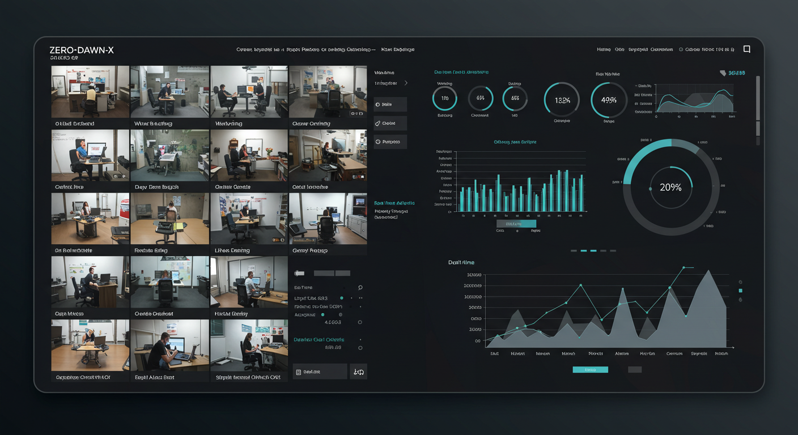

# Employee Work Time Recognizer



---

> **A modern, modular computer vision and employee management system for recognizing, logging, and managing employee work activities in professional environments.**

---

## Table of Contents
- [Overview](#overview)
- [Features](#features)
- [System Concept](#system-concept)
- [User Interface](#user-interface)
- [Project Structure](#project-structure)
- [Setup & Installation](#setup--installation)
- [Usage](#usage)
- [Code Organization Principles](#code-organization-principles)
- [License](#license)

---

## Overview
Employee Work Time Recognizer is a scalable, production-ready solution designed for organizations to monitor, recognize, log, and manage employee work activities using computer vision and advanced analytics. The system is built for deployment in office environments, supporting multiple cameras and users, and is architected for easy integration and extension. In addition to activity analysis, it provides comprehensive employee management features for modern workplaces.

---

## Features
- Minimal, modern PyQt5 GUI for control and monitoring
- Real-time video feed integration
- Modular architecture for enterprise scalability
- **Employee management dashboard**
- **Attendance tracking and automated check-in/check-out**
- **Shift scheduling and management**
- **Performance analytics and productivity reports**
- **Integration with HR and payroll systems**
- Activity recognition (work, sleep, eat, idle) *(in progress)*
- Local and/or centralized time logging and reporting *(upcoming)*
- Professional UX/UI principles for business environments

---

## System Concept

The following images illustrate the type of environment and monitoring this system is designed for. These are not actual user interfaces, but conceptual images to help understand the system's purpose.

|  |  |
|:---------------------------------------------------:|:-----------------------------------------------------:|
|  |       |

---

## User Interface

*The application features a modern, minimal PyQt5 interface with a central video feed, employee management dashboard, and clear controls. Designed for clarity and ease of use in professional settings. A real screenshot will be added here as development progresses.*

---

## Project Structure

| Folder/File      | Purpose                                 |
|------------------|-----------------------------------------|
| `camera/`        | Video capture and camera integration    |
| `detection/`     | Activity recognition logic and models   |
| `logging/`       | Time logging and storage                |
| `reporting/`     | Report generation                       |
| `ui/`            | User interface (PyQt5)                  |
| `main.py`        | Application entry point                 |
| `requirements.txt`| Dependencies                            |
| `README.md`      | Project overview                        |

---

## Setup & Installation

1. **Clone the repository:**
   ```sh
   git clone https://github.com/ZERO-DAWN-X/employee-work-recognizer
   cd employee-work-recognizer
   ```
2. **Install dependencies:**
   ```sh
   pip install -r requirements.txt
   ```
3. **Run the application:**
   ```sh
   python main.py
   ```

---

## Usage
- Deploy the system in your office or organization to monitor and manage employee work activities.
- Use the GUI to control video feeds, manage employee profiles, track attendance, schedule shifts, and review activity logs and performance analytics.
- Integrate with HR and payroll systems for seamless workforce management.
- Future updates will add advanced activity detection, centralized logging, and reporting.

---

## Code Organization Principles
- **Component-based:** Each feature is in its own directory.
- **Modular:** Code is easy to extend and maintain for enterprise needs.
- **Separation of concerns:** UI, detection, logging, reporting, and management are clearly separated.
- **Professional UX/UI:** Clean, minimal, and user-focused design for business environments.

---

## License
MIT License 